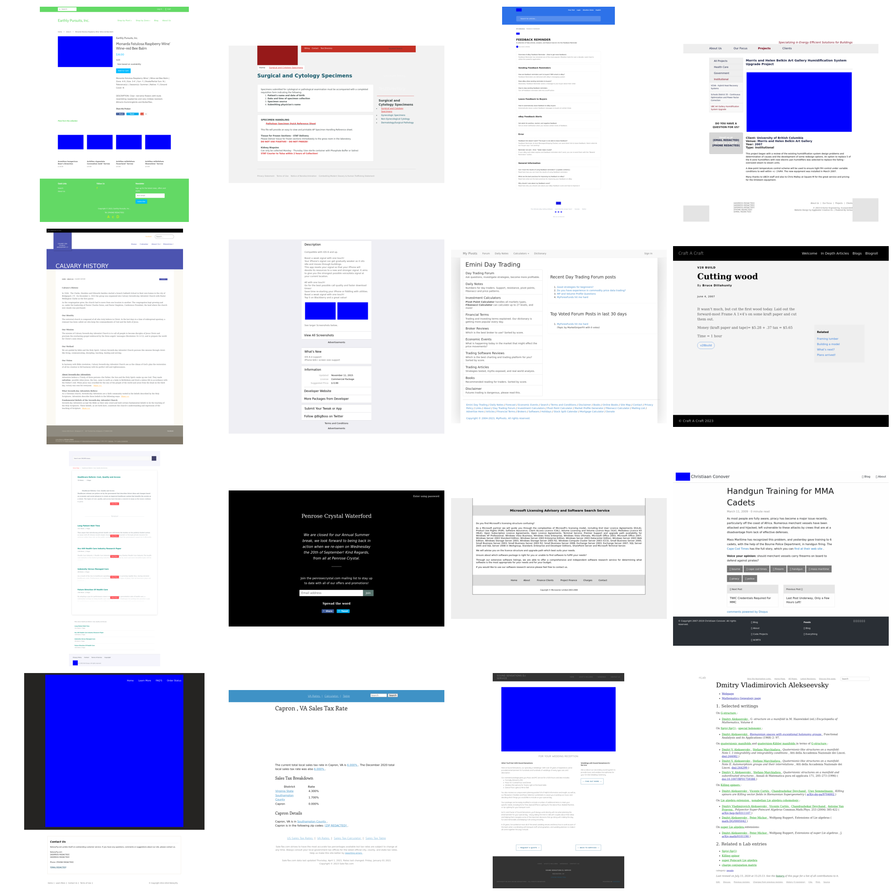

# Pix2Code: Benchmarking Multimodal Code Generation

## Data

We have two versions of the test set: 

1. The full test set can be downloaded from [this link](https://drive.google.com/file/d/1fUwEFLeo4XNntzgP-eMAlO38j4CHv205/view?usp=drive_link). It contains 776 examples. 

2. The mini version is a subset of 100 examples and can be loaded from the `testset_100` directory. Below is a snapshot of some examples. 

## Prediction Files

GPT-4V Predictions Full [link](https://drive.google.com/file/d/1jFUhb3PuuZsmL9p9O5lKdDed106XG9PT/view?usp=sharing)

Gemini-Pro Predictions Full: [link](https://drive.google.com/file/d/1fUwEFLeo4XNntzgP-eMAlO38j4CHv205/view?usp=sharing)

## Code Structure

- `data_utils` contains the filtering and processing scripts to construct the test data from C4. 

- `metrics` contains the metric scripts for the evaluation.

- `prompting` contains the code for running all the prompting experiments, including the actual prompts used. 