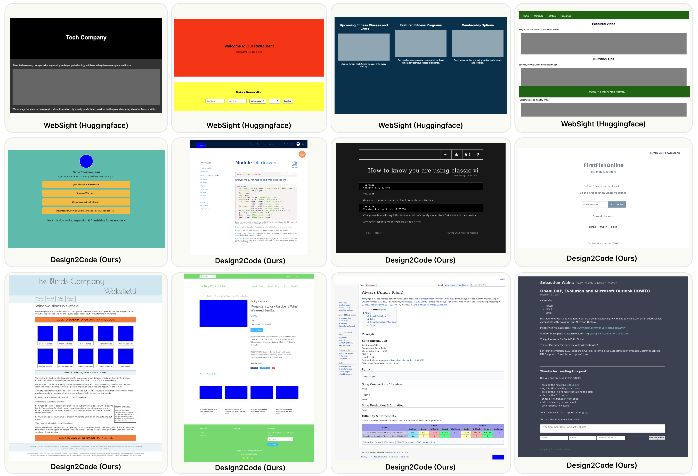

# Design2Code

__Design2Code: How Far Are We From Automating Front-End Engineering__

*Chenglei Si, Yanzhe Zhang, Zhengyuan Yang, Ruibo Liu, Diyi Yang*

Abstract

Generative AI has made rapid advancements in recent years, achieving unprecedented capabilities in multimodal understanding and code generation. This enabled a brand new paradigm of front-end development, where multimodal LLMs can potentially convert visual designs into code implementations directly, thus automating the front-end engineering pipeline. In this work, we provide the first systematic study on this visual design to code implementation task (dubbed as Design2Code). We manually curate a benchmark of 484 real-world webpages as test cases and develop a set of automatic evaluation metrics to assess how well current multimodal LLMs can generate the code implementations that directly render into the given reference webpages, given the screenshots as input. We develop a suit of multimodal prompting methods and show their effectiveness on GPT-4V and Gemini Vision Pro. We also finetune an open-source Design2Code-18B model that successfully matches the performance of Gemini Vision Pro. Both human evaluation and automatic metrics show that GPT-4V is the clear winner on this task, where annotators think GPT-4V generated webpages can replace the original reference webpages in 49% cases in terms of visual appearance and content; and perhaps surprisingly, in 64% cases GPT-4V generated webpages are considered better than even the original reference webpages. Our fine-grained break-down metrics indicate that open-source models mostly lag in recalling visual elements from the input webpages and in generating correct layout designs, while aspects like text content and coloring can be drastically improved with proper finetuning.

## Overview

- Test set: The full official test set is availble for downloading at [this link](https://drive.google.com/file/d/1AdqgWx8wgz_GM1qeupY1eyUiT7E2zo6_/view?usp=sharing). It contains 484 screenshot-code pairs. 

- GPT-4V and Gemini-Pro predictions: All predictions (including rendered webpage screenshots) are available for downloading at [this link](https://drive.google.com/file/d/1zinGz87_4Y-YIkeA4uPgaoxITAMjjObH/view?usp=sharing).

- Websight predictions: [this link](https://drive.google.com/file/d/1pNmAiGC259t_1VBfNeq7JI98RSM7zMHo/view?usp=sharing)

- Pix2Code-18B predictions: [this link](https://drive.google.com/file/d/16meY5D_TWiXo7K1IUMLjoXhFH6DaSbLO/view?usp=sharing)

- Sampled predictions for human evaluation: The sampled predictions used to obtain human evaluation can be found [here](https://drive.google.com/file/d/1L3tj35o9QiWEcDH95XpGFAZUij6LNAHu/view?usp=sharing).

## Installation

## Example Script

## Code Structure

- `data_utils` contains the filtering and processing scripts to construct the test data from C4. 

- `metrics` contains the metric scripts for the evaluation.

- `prompting` contains the code for running all the prompting experiments, including the actual prompts used. 
